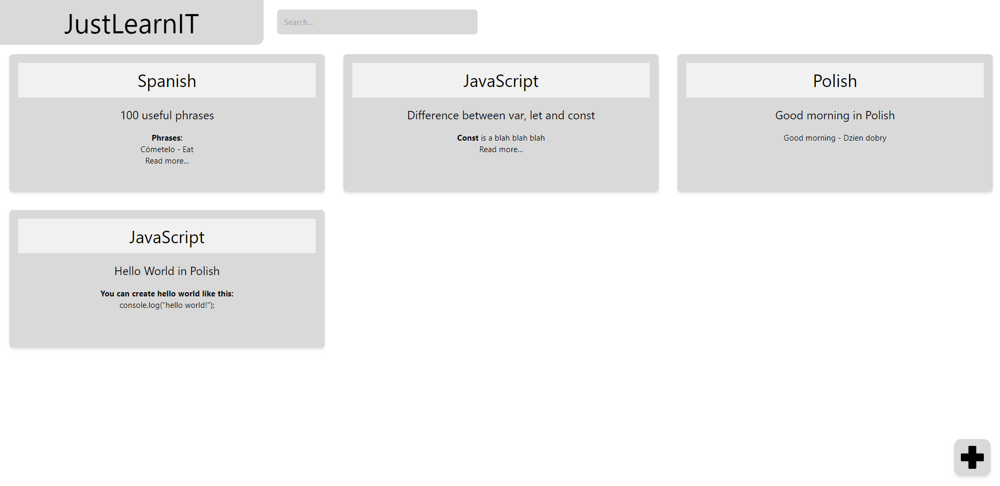
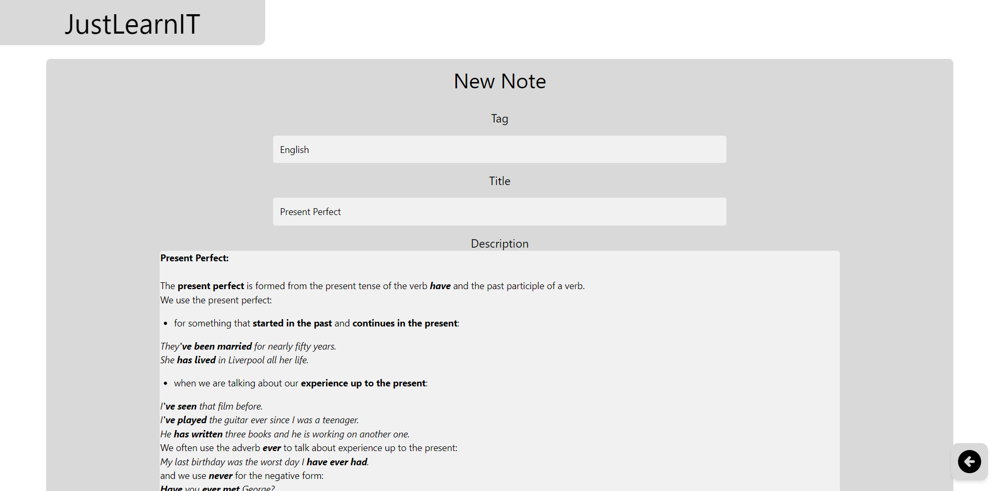
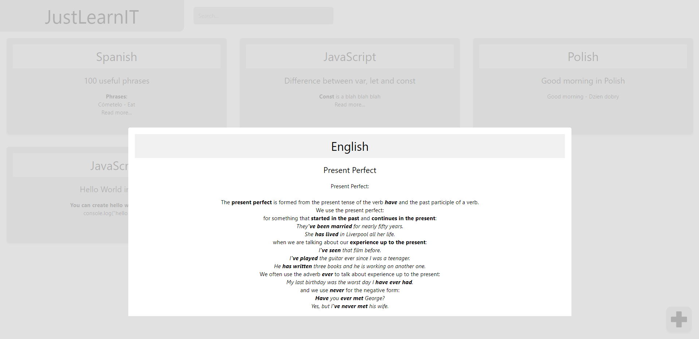
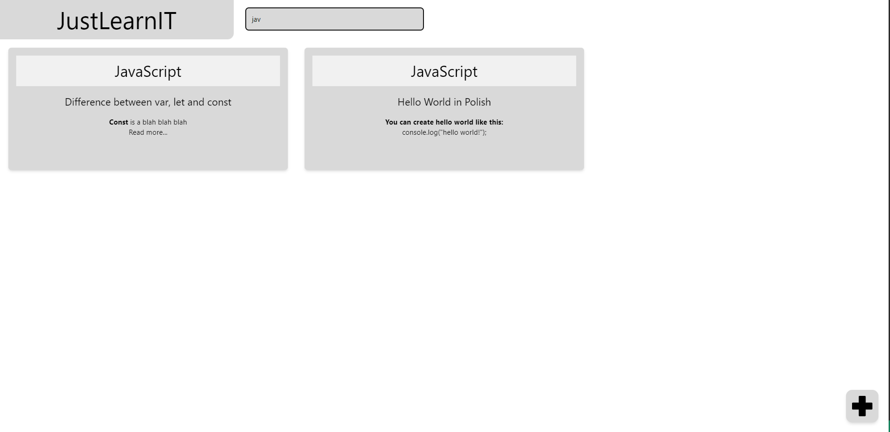

# JustLearn IT

## About

Simple note app for learning.

## TechStack

 * TypeScript
 * React
 * Tailwind CSS
 * NestJS

## Screenshots

## Available Scripts

Details about running scripts are separately in justlearnit and justlearnit-backend folder
